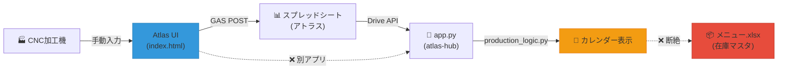
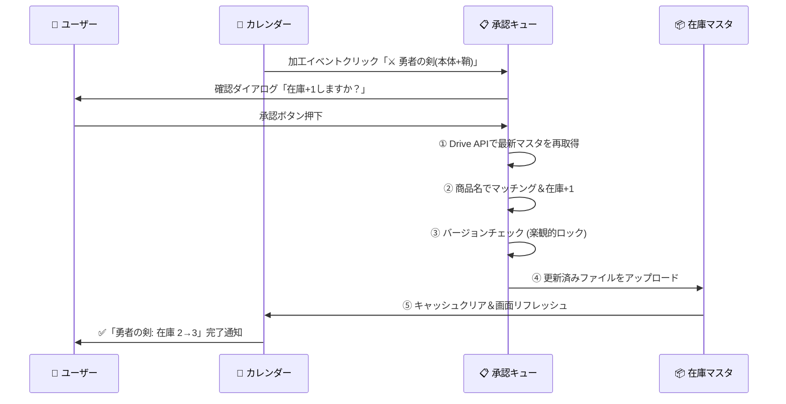

# Atlas Hub「真の統合」技術提案

## 現状診断：パイプラインの断絶箇所

調査の結果、**コードは書かれているが「接続されていない」箇所**が複数存在する。



| 断絶箇所 | 詳細 |
|---|---|
| **在庫書き戻し** | `inventory.py` に `update_master_inventory()` が実装済みだが、`drive_utils.py` に呼び出し先の `update_file_content()` と `find_file_by_partial_name()` が**未実装** |
| **入力画面の分離** | Atlas入力UI (`atlas/index.html`) は完全な独立SPA。atlas-hub と物理的にもデータ的にも未結合 |
| **確認→確定フロー** | カレンダーの「確定ボタン」 → `update_master_inventory()` の接続が `app.py` 側で未実装 |

---

## 提案 1：在庫連動（書き戻し）

### 結論：**Python（Streamlit）を主軸にすべき**

| 軸 | Python (Streamlit) | GAS |
|---|---|---|
| 排他制御 | ✅ Streamlit session_state + Drive API のファイルロックが使える | ❌ GASにはファイルロック機構がない |
| トランザクション整合性 | ✅ read → validate → write を1プロセスで完結 | ⚠️ POST受信 → Sheet操作、タイミング問題 |
| 監査ログ | ✅ Streamlit UIに操作ログを表示可能 | ❌ GAS のログは見えにくい |
| ユーザー体験 | ✅ カレンダー上で確認→確定→即反映 | ❌ 別タブ/別ツールに遷移が必要 |

### 設計案：「承認キュー方式」



### 排他制御の具体策

```python
# 楽観的ロック: modifiedTime ベース
def safe_update_inventory(item_name):
    service = authenticate()
    
    # ① 最新ファイルを取得（キャッシュ不使用）
    file_info = service.files().get(
        fileId=file_id, 
        fields='modifiedTime'
    ).execute()
    lock_time = file_info['modifiedTime']
    
    # ② 在庫更新 (メモリ上)
    df = download_and_edit(service, file_id, item_name)
    
    # ③ アップロード前に再チェック
    current_info = service.files().get(
        fileId=file_id, 
        fields='modifiedTime'
    ).execute()
    
    if current_info['modifiedTime'] != lock_time:
        return False, "⚠️ 他の操作と競合しました。再試行してください。"
    
    # ④ 安全にアップロード
    upload(service, file_id, df)
    return True, "✅ 在庫を更新しました"
```

### 必要な実装変更

| ファイル | 変更内容 |
|---|---|
| [drive_utils.py](file:///c:/Users/yjing/.gemini/atlas-hub/logic/drive_utils.py) | `find_file_by_partial_name()`, `update_file_content()`, `download_file_content()` を追加 |
| [inventory.py](file:///c:/Users/yjing/.gemini/atlas-hub/logic/inventory.py) | `update_master_inventory()` に楽観的ロック機構を追加 |
| [app.py](file:///c:/Users/yjing/.gemini/atlas-hub/app.py) | `st.button("在庫確定")` → `update_master_inventory()` 呼び出しを接続 |

---

## 提案 2：Atlas 実績入力の同居

### 結論：**サイドバーではなく「タブ統合」すべき**

| 方式 | メリット | デメリット |
|---|---|---|
| **サイドバー** | 常にアクセス可 | Streamlit サイドバーは幅狭（~300px）。入力フォームが窮屈 |
| **タブ統合 ✅** | 画面全幅を使える。動線が自然 | タブ切替1回必要 |
| **モーダル** | 画面遷移なし | 背景のカレンダーが隠れる |

### 「究極のコクピットUI」設計

```
┌────────────────────────────────────────────────────┐
│ 🏠 Atlas Hub                                       │
├──────┬──────┬──────┬──────┬────────────────────────┤
│ 📅   │ 📊   │ 🏭   │ 📦   │                        │
│ Map  │ Cal  │Input │Stock │      (将来拡張)         │
├──────┴──────┴──────┴──────┴────────────────────────┤
│                                                    │
│  [選択中のタブのコンテンツ]                           │
│                                                    │
│  🏭 Input タブ選択時:                               │
│  ┌─────────────────────────────────┐               │
│  │ Machine: ○ Gigas  ○ Hermes     │               │
│  │ Path & Log: [textarea]          │               │
│  │ [Analyze & Verify]              │               │
│  │                                 │               │
│  │ → 確認モーダル → GAS送信        │               │
│  │ → 送信成功時、自動でCalタブへ遷移 │              │
│  └─────────────────────────────────┘               │
│                                                    │
│  📦 Stock タブ選択時:                               │
│  ┌─────────────────────────────────┐               │
│  │ 商品カタログ + 在庫数表示        │               │
│  │ 承認待ちキュー                   │               │
│  └─────────────────────────────────┘               │
│                                                    │
└────────────────────────────────────────────────────┘
```

### 実装方式

Atlas入力UIをStreamlitに**直接移植するのではなく、iframe埋め込み**で統合する。

**理由**:
1. `atlas/index.html` は874行の完成されたSPA。Zeus Logicなど複雑なフロントエンドロジックをPythonに再実装するのは無駄と危険
2. `st.components.v1.html()` で既にiframe使用実績あり (PM calendar)
3. GAS URLの設定は `localStorage` で管理されており、iframe内でも動作

```python
# app.py: Input タブの実装
with tabs[2]:  # 🏭 Input タブ
    st.subheader("🏭 加工実績入力")
    
    atlas_html = open("atlas/index.html", "r", encoding="utf-8").read()
    st.components.v1.html(atlas_html, height=700, scrolling=True)
    
    st.caption("入力完了後、カレンダータブで反映を確認してください。")
```

> [!IMPORTANT]
> `atlas/index.html` のGAS送信成功後、`parent.postMessage('atlas-submitted', '*')` でStreamlit側に送信完了を通知し、カレンダーのキャッシュをクリアすることも将来的に検討する。

---

## 提案 3：自律的チェック項目の追記

### `仕様書.md` への追記

| 追加セクション | 内容 |
|---|---|
| **§3. 在庫連動プロトコル** | 楽観的ロックの仕様、modifiedTime チェック、フォールバック連鎖 |
| **§4. データパイプライン完全性チェック** | Input → Log → Calendar → Inventory の各段階で「次の段階に正しく渡っているか」の検証項目 |

### `skill.md` への追記

```diff
+ ### パイプライン完全性の規律
+ - 「表示できた」で完了としない。「データが次のステップに流れるか」まで検証せよ。
+ - 具体的チェック:
+   1. 関数Aが関数Bを呼んでいる → 関数Bは実在するか？ (今回の drive_utils 断絶の教訓)
+   2. UIのボタンがバックエンド関数を呼んでいる → その関数は app.py のどこから呼ばれるか？
+   3. Write-back が発生する → 上書き前の値を保存しているか？ ロールバック可能か？
```

### `rules.md` への追記

```diff
+ ### データパイプライン・ルール
+ - Rule: "Dead Code Detection" — 関数を書いたら、それを呼ぶ場所も同時に実装せよ。
+   呼び出し元のない関数は存在しないのと同じ。
+ - Rule: "Write-back Safety" — マスタデータへの書き込みには必ず
+   (1) 楽観的ロック、(2) 操作ログ、(3) UI上の確認ダイアログを伴うこと。
```

---

## 実装ロードマップ

| Phase | 内容 | 規模 |
|---|---|---|
| **Phase 1** | `drive_utils.py` に欠落関数を実装し、在庫書き戻しパイプラインを接続 | 中 |
| **Phase 2** | `app.py` に在庫確定UIを実装（カレンダー連動） | 中 |
| **Phase 3** | Atlas入力タブを `app.py` に統合（iframe方式） | 小 |
| **Phase 4** | Stock（在庫照会）タブの新設 | 小 |
| **Phase 5** | ドキュメント更新 (`仕様書.md`, `skill.md`, `rules.md`) | 小 |

## 検証計画

### 自動検証
- `drive_utils.py` の新関数に対する単体テスト
- 楽観的ロックの競合シミュレーションテスト
- `production_logic.py` → `inventory.py` のデータフロー結合テスト

### 手動検証
- ブラウザでの在庫確定フロー: カレンダー → クリック → 確認 → 在庫更新 → 反映確認
- Atlas入力タブでの送信 → カレンダータブでの表示確認
